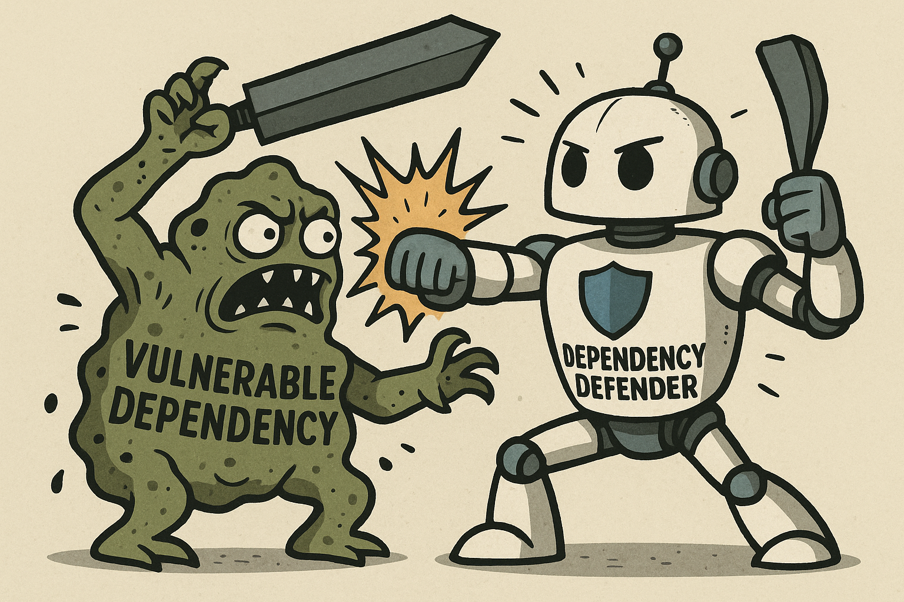

# VulnerabilityAgent 🛡️

An autonomous agent built on the [BeeAI Framework](https://github.com/i-am-bee/beeai-framework) and [AgentStack](https://github.com/i-am-bee/agentstack) that scans a GitHub repository's Python dependencies for known vulnerabilities and files remediation issues on your behalf.



## Purpose
- Detect vulnerable packages declared in `uv.lock` files.
- Cross-reference dependencies against the Sonatype OSS Index to surface known CVEs.
- Draft and file GitHub issues describing each finding and the recommended remediation.

## Prerequisites
- Python 3.13 or newer.
- [uv](https://docs.astral.sh/uv/) (recommended) or another tool for managing virtual environments.
- [Agent Stack Platform](https://docs.beeai.dev/introduction/quickstart) and CLI.
- Access to the following external services:
  - GitHub account that can create Personal Access Tokens.
  - Sonatype OSS Index account (free).
  - LLM provider credentials (tested with `openai/gpt-4.1-mini` via Agent Stack Platform).

## Required Secrets
All secrets can be provided through the Agent Stack UI when prompted.

- **GitHub Personal Access Token (`GITHUB_PAT`)**
  - Go to [https://github.com/settings/tokens](https://github.com/settings/tokens).
  - Create a classic token with the `repo` scope (minimum: `repo:status`, `public_repo`, and `repo_deployment` if you expect to work with private repositories).
  - Save the token for later; GitHub only shows it once.
  Note: you can also create a fine-grained GITHUB_PAT, but ensure that it is scoped to the proper repo and has read and write permissions set.

- **OSS Index Credentials (`OSS_INDEX_API`, `OSS_INDEX_EMAIL`)**
  - Register or sign in at [https://ossindex.sonatype.org](https://ossindex.sonatype.org).
  - Navigate to *Account* -> *API Tokens* and generate a token.
  - Use your account email for `OSS_INDEX_EMAIL` and the generated token for `OSS_INDEX_API`.

- **OpenAI Key (to configure on Agent Stack Platform)**
  - Follow the instructions below to set your preferred provider and supply the API key.


## Running the Agent
!! NOTE: The Agent will write github issues on your behalf! If you do not want this, don't run the agent!

### Platform-Managed Agent

1. Install the AgentStack platform per the quickstart instructions: [AgentStack Quickstart](https://agentstack.beeai.dev/introduction/quickstart).
2. Start the Agent Stack platform with observability (optional but recommended):
   ```bash
   agentstack platform start --set phoenix.enabled=true
   ```
3. Complete the Agent Stack model setup with OpenAI as your provider:
   ```bash
   agentstack model setup
   ```
4. After model setup completes, launch the Agent Stack UI:
   ```bash
   agentstack ui
   ```

5. On the Agent Stack UI Home page slect `Add new agent`on the top right

6. Select the docker image option and paste in:
   ```bash
   ghcr.io/sandijean90/vulnerabilityagent/my-agent:0.0.3
   ```
7. Press continue and your agent should build in the platform! Refresh your home page to see the **Dependency Defender**!

8. In the Agent Stack UI, select the **Dependency Defender** agent and submit the form with:
   - `Repo URL` — the public GitHub repository you want to scan.
   - `Github Issue Style` — choose `concise` or `detailed` to control the generated issue format.
   - Model (recommended/default gpt-4.1-mini).
   - Accept the terms checkbox.

The agent orchestrates all tool calls, streams progress through trajectories, and posts a final summary with citation metadata.


### Self-Managed Agent Service


1. Clone and enter the project:
```bash
git clone https://github.com/sandijean90/VulnerabilityAgent.git
cd VulnerabilityAgent
```

2. Create the environment and install dependencies (uv preferred):
```bash
uv sync
```

3. Install the AgentStack platform per the quickstart instructions: [AgentStack Quickstart](https://agentstack.beeai.dev/introduction/quickstart).
4. Start the Agent Stack platform with observability (optional but recommended):
   ```bash
   agentstack platform start --set phoenix.enabled=true
   ```
5. Complete the Agent Stack model setup with OpenAI as your provider:
   ```bash
   agentstack model setup
   ```
6. After model setup completes, launch the Agent Stack UI:
   ```bash
   agentstack ui
   ```
7. Run the agent service from this repository (this is the only executable entry point you need):
   ```bash
   uv run -m agentstack_agents.agent
   ```
8. In the Agent Stack UI, select the **Dependency Defender** agent and submit the form with:
   - `Repo URL` — the public GitHub repository you want to scan.
   - `Github Issue Style` — choose `concise` or `detailed` to control the generated issue format.
   - Model (recommended/default gpt-4.1-mini).
   - Accept the terms checkbox.

The agent orchestrates all tool calls, streams progress through trajectories, and posts a final summary with citation metadata.


### Sample Repositories for Testing
- [https://github.com/OurRepos/bad-repo](https://github.com/OurRepos/bad-repo) - contains vulnerable dependencies to exercise issue creation.
- [https://github.com/OurRepos/good-repo](https://github.com/OurRepos/good-repo) - clean baseline to validate the "no vulnerabilities found" path.

## Next Steps
- Review the BeeAI traces at [http://localhost:6006](http://localhost:6006) (Phoenix) to audit each tool call.
- Check the analyzed repo for new issues created by the Vulnerability Agent.

## How the System Works
1. **Form Intake** - The agent receives the repository URL and preferred issue style through the Agent Stack form extension.
2. **Secret Retrieval** - AgentnStack secrets extension supplies the GitHub PAT and OSS Index credentials on demand.
3. **Tool Preparation** - Through Agent Stack, the agent builds repository-scoped MCP tools for creating issues, then instantiates the dependency reader and vulnerability scanner.
4. **Dependency Extraction** - `GitHubUvLockReaderURLMinimal` locates every `uv.lock` file in the target repository and returns a normalized list of packages.
5. **Vulnerability Scan** - `OSSIndexFromContextTool` batches the package list into Sonatype OSS Index queries and captures CVE data.
6. **Issue Creation** - When vulnerabilities exist, the agent drafts GitHub issues (concise or detailed) and files them via the MCP GitHub issue tool.
7. **Final Report** - The agent streams its reasoning, emits citation metadata for every link, and stores a final message summarizing the findings.
